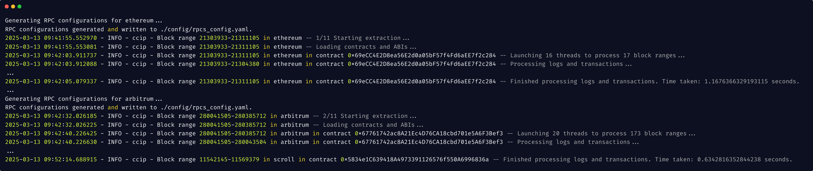
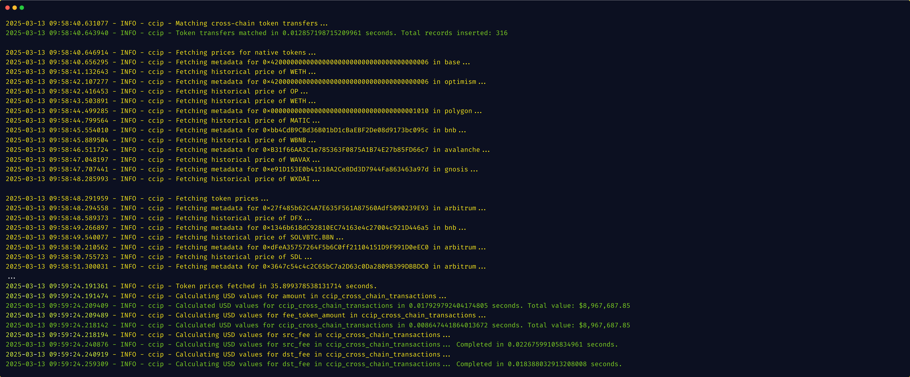
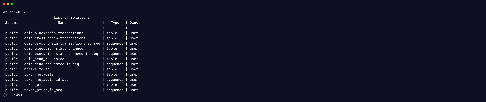

<h2><center>WhiteBlueBenchmark: A Cross-Chain Dataset Generation Framework</center></h2>

<span><center>[](https://opensource.org/licenses/MIT)
[](https://www.python.org/downloads/release/python-3110/) [](https://github.com/AndreAugusto11/XChainWatcher/blob/main/CONTRIBUTING.md) </center></span>

This repository contains the code for WhiteBlueBenchmark, a cross-chain dataset extraction and generation framework -- i.e., a tool that **extracts** cross-chain data from bridge contracts in multiple blockchains and **generates** datasets of cross-chain transactions (CCTX).

📄 Paper: [https://arxiv.org/abs/2503.13637](https://arxiv.org/abs/2503.13637)

📈 Dataset (Jun 2024 - Dec 2024): [https://zenodo.org/records/15341722](https://zenodo.org/records/15341722)


### Project structure

```
.
├──.vscode/                          # Configurations to launch the application in VSCode
├── analysis/                        # R scripts for data analysis
│   ├── data/                        # Generated data in CSV format
│   ├── R Scripts/                   # R scripts for the analysis of data
│   ├── generate_csv.ipynb           # Extracts data from database and converts into CSV (saved in the `data` folder)
│   └── paper-visualizations.ipynb   # Main analysis of the data
├── cli/
│   └── cli.py                       # Command Line Interface
├── config/
│   ├── constants.py                 # File with the constants for the project (blockchains and bridges supported)
│   ├── rpcs_base_config.py          # List of public RPCs used for extracting data from each blockchain
│   └── rpcs_config.py               # File with the list of all available RPCs (i.e., returning 200), generated in runtime
├── extractor/
│   ├── across/                      # Data extraction logic for events emitted by across's contracts
│   │   ├── ABIs/            
│   │   │   ├── arbitrum/            # The ABIs for each Across contract deployed in Arbitrum
│   │   │   └── avalanche/           # The ABIs for each Across contract deployed in Avalanche
│   │   │       ...
│   │   ├── constants.py             # Definition of all contract addresses, for all blockchains, and events of interest for each contract
│   │   ├── decoder.py               # A custom decoder for the events emitted by the contracts
│   │   └── handler.py               # Received a set of events, and stores in the database according to the defined schema
│   ├── ccip/                        # Data extraction logic for events emitted by ccip's contracts
│   │   └──  ...
│   ├── cctp/                        # Data extraction logic for events emitted by cctp's contracts
│   │   └──  ...
│   │   ...
│   ├── decoder.py                   # Base decoder logic
│   └── extractor.py                 # Base extraction logic
├── generator/
│   ├── common/                      # Cross-chain transaction generation logic for across
│   │   └──  price_generator.py      # Fetches token metadata and token prices for each token transacted
│   ├── across/                      # Cross-chain transaction generation logic for across
│   │   └── generator.py             # Cross-chain transaction generator for across
│   ├── ccip/                        # Cross-chain transaction generation logic for ccip
│   │   └── ...
│   ├── cctp/                        # Cross-chain transaction generation logic for cctp
│   │   └── ...
│   │   ...
│   └── generator.py                 # Base generation logic
├── repository/
│   ├── across/                      # Implementation of repository pattern, with the definition of data models for across
│   │   ├── models.py                # Definition of data models for all relevant events
│   │   └── repository.py            # Definition of the repository for across
│   ├── ccip/                        # Implementation of repository pattern, with the definition of data models for ccip
│   │   └── ...
│   ├── cctp/                        # Implementation of repository pattern, with the definition of data models for cctp
│   │   └── ...
│   │   ...
│   ├── base.py                      # Implementation of base repository, extended by all concrete implementations (CRUD operations)
│   └── database.py                  # Main logic for database creation
├── rpcs/
│   └── generate_rpc_configs.py      # Generate config file based on the public RPCs available for each blockchain
├── utils/                           # Datalog rules and facts
│   ├── rpc_utils.py                 # Management of RPC requests logic
│   └── utils.py                     # utils
└── __init__.py                      # Entry point of the application
```

## Data Extraction

The Extractor takes as input: (i) the bridge to be analyzed, (ii) a time interval defined using Unix timestamps, and (iii) a set of supported blockchains. The extraction process works as follows. It first loads the bridge configuration file, which specifies all relevant contract events for each blockchain where the bridge is deployed. The Extractor iterates over the user-specified blockchains, determining the nearest block numbers corresponding to the provided timestamps (i.e., the start and end blocks for each blockchain). It then divides this block range into intervals of 2,000 blocks and retrieves logs for all specified events in each contract using the eth_getLogs RPC method [./extractor/extractor.py](./extractor/extractor.py). For every captured event, the Extractor also fetches the corresponding transaction receipt and block information using *eth_getTransactionReceipt* and *eth_getBlockByNumber*. Each event is decoded using either a base decoder [./extractor/decoder.py](./extractor/decoder.py) or, when necessary, a custom decoder tailored to the specific contract and event type. The extracted data is then stored in a storage system [./repository/database.py](./repository/database.py), with each event written as a separate relation. To ensure flexibility, we implemented a Repository Pattern [./repository/base.py](./repository/base.py), abstracting the data layer and allowing different storage systems. By modifying the database configuration file, users can customize the storage system based on their specific dataset requirements. At the end of the extraction phase, the storage system contains all the data associated with the specified bridge events and blockchains.

## CCTX Generation
The Generator builds cross-chain transactions based on previously extracted data. The base generator dynamically loads a custom generator for the bridge to be analyzed [./generator/generator.py](./generator/generator.py). In these custom components, the data previously extracted and written to the storage system is read, and the different records are merged in order to create cross-chain transactions. Records are merged based on cross-chain transaction identifiers (called deposit IDs, withdrawal IDs, or message IDs depending on the protocol), which link actions on both chains, also based on the sender, recipient, and tokens being transferred, which are always data available on both sides that can be used for linkability. The specific fields through which records are merged depend on the logic of each bridge. At the end of this phase, the storage system also contains datasets of cross-chain transactions.


## A Quick Start (Docker)
The quick start leverages the [docker-compose.yaml](./docker-compose.yaml) file. It sets up a container running postgres, and the configuration for the application.

### Requirements
- Docker
- Docker Compose (optional for local PostgreSQL setup)

### Build & Start Containers
```bash
docker-compose up --build -d
```
The -d flag runs the containers in detached mode.

### Running WhiteBlueBenchmark CLI Commands

Extract the data related to a single bridge in multiple contracts using the following template:

```bash
docker-compose run --rm app extract --bridge <BRIDGE_NAME> --start_ts <START_TIMESTAMP> --end_ts <END_TIMESTAMP> --blockchains <BLOCKCHAIN_1> <BLOCKCHAIN_2> ... <BLOCKCHAIN_N>
```

To override the default data storage, use the `-e` flag to assign a new value to the environment variable DATABASE_URL (e.g., `-e DATABASE_URL=postgresql://user:password@db:5432/ccip`).

⚠️ Take into consideration that, depending on the number of contracts deployed for each bridge, on the number of events emitted by each in the interval of analysis, and the capabilities of your machine, this process can take long periods ⚠️

<br></br>
**Example for Cross-Chain Interoperability Protocol (CCIP by Chainlink) (~10 minutes)**

Extract the data related to CCIP from Dec 01, 2024 00:00:00 GMT+0000 to Dec 02, 2024 00:00:00 GMT+0000.

**Unix timestamp:** 1733011200 (Sun Dec 01 2024 00:00:00 GMT+0000)

**Unix timestamp:** 1733097600 (Sun Dec 02 2024 00:00:00 GMT+0000)


```bash
docker-compose run --rm app extract --bridge ccip --start_ts 1733011200 --end_ts 1733097600 --blockchains ethereum arbitrum avalanche polygon optimism base bnb gnosis ronin linea scroll
```

#### Cross-Chain Transaction Generator (~1 minute)
Generate cross-chain transactions, linking events and data across blockchains.

```bash
docker-compose run --rm app generate --bridge ccip
```

#### Retrieve Generated Data
Access the database container, and enter the database (the default database is `db_app`).

```bash
docker exec -it my_postgres psql -U user -d db_app
```

Run the `\d` command to list all relations in the database.

For CCIP, all cross-chain transactions will be in the ccip_cross_chain_transactions table.

```sql
select count(*) from ccip_cross_chain_transactions;
```

### Output Examples
We provide some examples of what you can expect in a successful run of WhiteBlueBenchmark:

#### Data Extraction for CCIP


#### CCTX Generation for CCIP


#### Database Relations for CCIP



## Run locally
WhiteBlueBenchmark can also be ran locally in your host machine.

### Requirements
- Postgres (v14)
- Python (v3.11.5)
- Virtualenv (optional)

#### Python & Virtualenv -- Installation Linux (Ubuntu)
```
sudo add-apt-repository ppa:deadsnakes/ppa
sudo apt update
sudo apt install python3.11

sudo apt install python3.11-venv
```

#### Python & Virtualenv -- Installation MacOS
```
brew install python@3.11
pip install virtualenv
```

### Setup
Firstly, make sure Postgres is installed and you have a working database running in your own machine.

1. Create virtual environment `python3.11 -m venv .whitebluebenchmark`
2. Activate virstual environment `source .whitebluebenchmark/bin/activate`
3. Install all dependencies `pip install -r requirements.txt`
4. To stop using the env, run `deactivate`
5. Create a `.env` file setting the `DATABASE_URL` variable according to your database connection.

#### Using Terminal

### Data Extraction

```shell
python3.11 __init__.py extract --bridge <BRIDGE_NAME> --start_ts <START_TIMESTAMP> --end_ts <END_TIMESTAMP> --blockchains <BLOCKCHAIN_1> <BLOCKCHAIN_2> ... <BLOCKCHAIN_N>
```

### CCTX Generation

```shell
python3.11 __init__.py generate --bridge <BRIDGE_NAME>
```

#### Using VSCode
1. Open the project in VS Code.
2. Make sure you have the Python extension installed.
3. Open the Command Palette (Cmd+Shift+P on macOS or Ctrl+Shift+P on Windows/Linux).
4. Type "Python: Select Interpreter" and choose the interpreter in your whitebluebenchmark virtual environment (python 3.11).
5. Open the Debug view (Ctrl+Shift+D or Cmd+Shift+D on Mac).
6. From the dropdown at the top of the Debug view, select one of the options:

```
* [Stargate] test
* [Stargate] generate cross-chain transactions
* [Across] test
* [Across] generate cross-chain transactions
* [Omnibridge] test
* [Omnibridge] generate cross-chain transactions
* [Ronin] test
* [Ronin] generate cross-chain transactions
* [CCTP] test
* [CCTP] generate cross-chain transactions
* [CCIP] test
* [CCIP] generate cross-chain transactions
* [Polygon] test
* [Polygon] generate cross-chain transactions
```

Click the green play button or press F5 to start debugging.

## Contributing

# Results and Data Analysis

The analysis of data extracted between Jun 1, 2024 and December 31, 2024 can be found in [./analysis/paper-visualizations-and-tables-generation.ipynb](./analysis/paper-visualizations-and-tables-generation.ipynb) and in [./analysis/R%20Scripts/paper-visualizations.R](./analysis/R%20Scripts/paper-visualizations.R).


## Suggested Citation
This work is an extension of our research. If using this repository, cite as:

``` bibtex
@misc{augusto2025whitebluebenchmarkcrosschaindatasetgeneration,
      title={WhiteBlueBenchmark: A Cross-Chain Dataset Generation Framework}, 
      author={André Augusto and André Vasconcelos and Miguel Correia and Luyao Zhang},
      year={2025},
      eprint={2503.13637},
      archivePrefix={arXiv},
      primaryClass={cs.CR},
      url={https://arxiv.org/abs/2503.13637}, 
}
```
